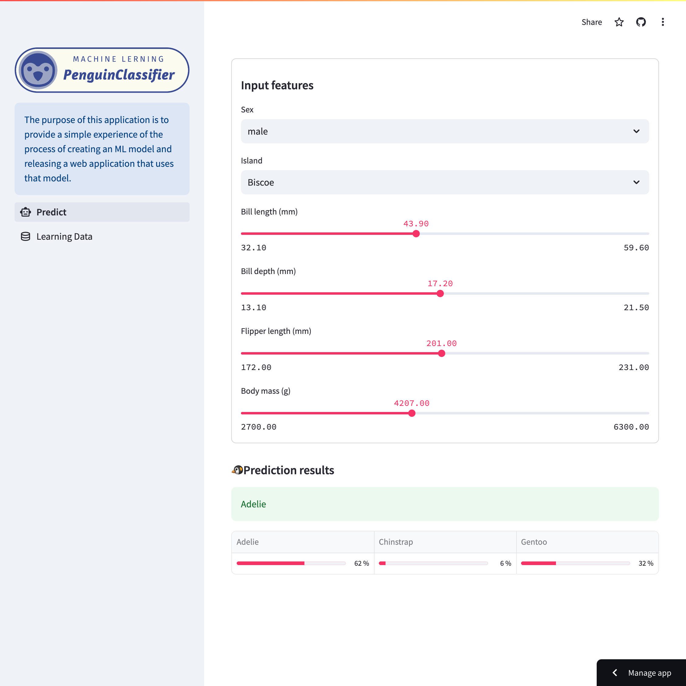

# 🤖 Machine Learning App

The purpose of this application is to provide a simple experience of the process of creating an ML model and releasing a web application that uses that model.

## Workflow
1. Model Creation: The Random Forest model is trained using a dataset of penguins, which is then saved using the joblib library for easy integration into the Streamlit app.
2. Model Integration in Streamlit: The saved model is loaded and integrated into the Streamlit application, allowing for interactive prediction based on user-selected features.
3. Deployment: The application is deployed on Streamlit Community Cloud, providing an easily accessible, hands-on experience of the complete model deployment pipeline.

## Demo App

   
   
Demo: https://yh-machinelearning.streamlit.app/

 

## What This App Does
This app allows users to explore the predictions made by a Random Forest model trained on the Palmer Penguins dataset. The model predicts penguin species based on various features such as species, island, bill measurements, flipper length, body mass, and sex. Users can interact with the app to see how different features influence the model's predictions.

## About Dataset

source: @allison_horst https://github.com/allisonhorst/penguins

 

The model is trained using the Palmer Penguins dataset, a widely recognized dataset for practicing machine learning techniques. This dataset provides information on three penguin species (Adelie, Chinstrap, and Gentoo) from the Palmer Archipelago in Antarctica. Key features include:

* Species: The species of the penguin (Adelie, Chinstrap, Gentoo).
* Island: The specific island where the penguin was observed (Biscoe, Dream, Torgersen).
* Bill Length: The length of the penguin's bill (mm).
* Bill Depth: The depth of the penguin's bill (mm).
* Flipper Length: The length of the penguin's flipper (mm).
* Body Mass: The mass of the penguin (g).
* Sex: The sex of the penguin (male or female).

This dataset is sourced from Kaggle, and it can be accessed [here](https://www.kaggle.com/datasets/parulpandey/palmer-archipelago-antarctica-penguin-data). The diversity in features makes it an excellent choice for building a classification model and understanding the importance of each feature in species prediction.

## Technology Stack
- Streamlit (>=1.26.0): For creating the web application interface.
- scikit-learn: For loading and using the pre-trained Random Forest model.
- NumPy & Pandas: For data manipulation and processing.
- Matplotlib & Seaborn: For generating visualizations.
